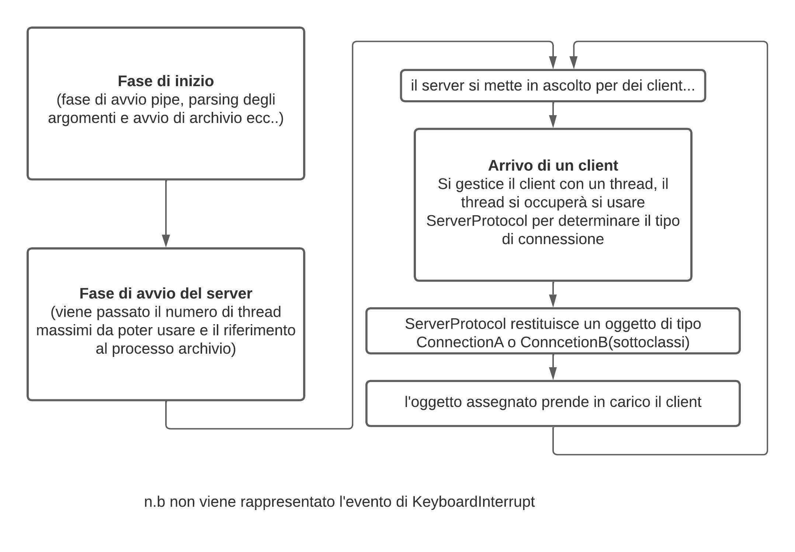

# Progetto finale laboratorio 2

Di seguito riporto alcune scelte implementative e alcuni dettagli.
I file legati al server si trovano sotto la cartella server_files. Nel repo è già presente l'eseguibile server.py .  Se si desiderasse generare un nuovo eseguibile si deve:
1. entrare nella cartella server_files,
2. Nel caso venisse usato pyinstaller verranno generati un file server.proc e due cartelle build e dist. 
3. Nella cartella dist è presente l'effettivo eseguibile, esso va spostato dove sono presenti anche i client e archivio
4. Infine si può rinominare server in server.py come da richiesta, volendo è possibile eliminare le cartelle build, dist e il file server.proc dopo queste operazioni. Per eseguire il progetto si deve prima fare make per generare tutti i vari eseguibili e solo successivamente avviare ./server.py

Di seguito parlo più dettagliamente del progetto.
# Server

Ho diviso la logica del server in diversi file. Volevo implementare un server che "nascondesse" il modo effettivo con cui venivano svolte alcune operazioni, come per esempio la gestione di un client, la gestione della pipe ecc..
Per questo ho creato 5 file:
1. server.py , il file da cui parte l'esecuzione del server
2. ServerProtocol.py , la classe padre che fornisce alcuni metodi alle sottoclassi e in generale si occupa di gestire i client, scrivere nel file di log
3. ConnectionA.py e ConncetionB.py , questi due file estendono la classe ServerProtocol.py , sfruttano i metodi messi a disposizione dal padre e definiscono internamente il proprio metodo di gestione del client. Inoltre entrambi le classi prevedono un membro globale per tutti gli oggetti che verranno istanziati da queste due classi, rispettivamente gli oggetti ConnectionA useranno tutti la pipe capolet(condividendo lo stesso oggetto creato con PipeManager), mentre gli oggetti di tipo ConnectionB avranno la propria pipe caposc
4. PipeManager.py , come citato nel punto precedente, questa classe essenzialmente implementa le operazioni sulla pipe, nulla di particolare in realtà, è più un "incapsulamento"

Di seguito riporto il "flusso" del programma
## Server.py

## Connection Class e PipeManager

Questi sono solo diagrammi semplificativi, non sono da prendere come rappresentazione esaustive ma solo come una rappresentazione ad alto livello. Manca per esempio nel diagramma del server la fase di chisura stessa del server. 

# Archivio
Ho deciso di spezzare anche qua leggermente la logica del programma in tre file:
1. Archivio.c , dove viene effettivamente svolto il lavoro
2. HashTableManager.c , usata in archivio per implementare le funzioni di aggiungi e conta oltre alle funzioni crea_entry e distruggi_entry
3. rwlock.c , usata per l'implementazione della comunicazione lettore-scrittore a favore dei lettori

Oltre a questi file faccio uso anche di xerorri.c, file usato durante il corso.
La creazione dei vari thread scrittore-capo, scrittori-consumatori e lettore-capo, lettori-consumatori e fine del thread gestore dei segnali viene svolta da archivio.c . Ho deciso di mantenere la logica in archivio in quanto il programma mi sembra leggibile cosi com'è e inoltre non volevo rendere troppo frammentata la logica di archivio.
Archivio è diviso in regioni, delimitate da commenti. Il main rappresenta una regione, nel main ho individuato 5 regioni:
1. Hash table e strutture iniziali
2.  Regione dichiarazione scrittore capo, scrittori consumatori e creazioni struct necessarie 
3. Regione dichiarazione lettore capo, lettori consumatori e creazioni struct necessarie
4.  Regione dichiarazione maschera segnali, creazione thread gestore dei segnali e struct necessaria
5. Regione di avvio dei thread
6. Regione di deallocazione della memoria 

Abbiamo altre 4 regioni:
1. Regione delle struct, in questa regione sono presenti le dichiarazioni delle struct che verranno usate, in archivio in questa regione sono presenti altre sotto divisioni per descrivere più precisamente a chi appartiene la struct. Il thread capo lettore e capo scrittore usano la stessa struct ( e lo stesso corpo del thread)
2. Regione corpo del capo lettore e capo scrittore, come anticipato i due capi usano lo stesso corpo in quanto quello che devono svolgere è la medesima funzione
3. Regione lettori consumatori, in questa regione è presente la funzione che i thread lettori consumatori eseguiranno
4. Regione scrittori consumatori, in questa regione è presente la funzione che i thread scrittori consumatori eseguiranno    
5.  Infine abbiamo la regione del thread gestore dei segnali, in questa regione oltre al corpo della funzione da eseguire è presente la struct usata da questo thread

Per quanto riguarda la comunicazione tra capi (singolo produttore) e gli n consumatori ho adottato una soluzione basata sui semafori, inoltre i thread consumatori hanno pure una pthread_lock_t per sincronizzarsi rispetto gli altri consumatori. Ho deciso di usare i semafori perché la condizione da controllare è un intero e quindi ho ritenuto non necessario usare le condition variable(oltre al fatto che non ho una lock per il capo in quanto ho un solo produttore). Questa struttura viene usata sia dai lettori capi e lettori consumatori ma anche dallo scrittore capo e gli scrittori consumatori per scrivere nel buffer.

Per quanto riguarda la gestione degli accessi in hashtable ho usato lo schema scrittore-lettore a favore dei lettori come visto a lezione. Nello specifico si usa un int per il numero di lettori, un bool per indicare se si sta scrivendo e infine una variabile di condizione e un mutex per controllare i vari accessi.

Riguardo la terminazione di archivio, esso termina come descritto all'arrivo del segnale SIGTERM da parte del server. La chiusurà delle pipe da parte del server e le join effettuate dal thread gestore dei segnali permettono di terminare con sicurezza.
Infatti i thread capi appena verranno chiuse le pipe interromperanno la loro esecuzione e prima di terminare segnalano la terminazione con il valore "termination_code" passato ai consumatori e grazie alla post nel semaforo sveglieranno un consumatore. Il consumatore che era in attesa sul semaforo a questo punto si sveglierà e la prima cosa che fa è controllare il valore di terminazione, se esso vale -1 allora deve terminare, prima di terminare sveglierà un altro consumatore in attesa che a sua volta svolgerà la stessa procedura.
Se ci fosse un cosumatore nella fase inerente alla scrittura o lettura dalla hash table allora semplicemente terminerà le sue operazioni sulla hash table e successivamente tornando al semaforo iniziale si accorgerà di dover terminare. Ho adottato questa soluzione in quanto non mi sembrava una idea ottimale interrompere i consumatori durante le loro operazioni nella hash table, oltre al fatto che è necessaria una maggiore complessità per implementare questa gestione.

Vorrei porre una maggiore attenzione al valore di terminazione, esso non viene passato nel buffer, rappresentà una variabile dedicata. Non scrivo nel buffer perché, come da indicazioni dal testo, esso è un buffer di puntatori a char. Quindi non ho ritenuto una buona soluzione scrivere un carattere da usare come valore di terminazione perché potenzialmente ogni carattere potrebbe essere inviato nel buffer e/o potrebbe cambiare il pattern usato con strtok.

La parte di deallocazione della memoria avviene nel main, una volta terminato il thread gestore dei segnali si riprende l'esecuzione nel main e per questo motivo ho deciso di mantenere la deallocazione nel main in modo da non dover passare troppi oggetti ad evenutali funzioni ausiliari, questo anche perché ho evitato esplicitamente di usare variabili globali in modo evitare modifiche involontarie a quest'ultime.

Anche per questo motivo anche di usare strotok_r in modo da evitare possibili sovrascritture della variabile globale usata da strtok standard, evitando cosi coomportamenti non previsiti.

 # Client
 Ho scritto i due client in c, entrambi i client leggono le proprie stringhe dai file tramite getline, ho implementato poi come da richiesta del testo le funzioni che svolgono i due client.
 Per iniviare la lunghezza della stringa ho usato uno short in quanto le stringhe hanno dimensione massima di 2048 caratteri quindi bastano log_2(2048) bit, ovvero 2 byte.

